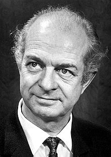

<table class="infobox biography vcard">
<tbody>
<tr>
<th colspan="2">

Linus Pauling

 

<a class="mw-redirect" title="Foreign Member of the Royal Society" href="https://en.wikipedia.org/wiki/Foreign_Member_of_the_Royal_Society">ForMemRS</a>

</th>
</tr>
<tr>
<td colspan="2">

Linus Pauling in 1962

</td>
</tr>
<tr>
<th scope="row">Born</th>
<td>

Linus Carl Pauling

 February 28, 1901 

<a title="Portland, Oregon" href="https://en.wikipedia.org/wiki/Portland,_Oregon">Portland, Oregon</a>, U.S.

</td>
</tr>
<tr>
<th scope="row">Died</th>
<td>August 19, 1994&nbsp;(aged&nbsp;93) 

<a title="Big Sur" href="https://en.wikipedia.org/wiki/Big_Sur">Big Sur</a>, California, U.S.

</td>
</tr>
<tr>
<th scope="row">Nationality</th>
<td class="category">American</td>
</tr>
<tr>
<th scope="row">Education</th>
<td>

<ul>
<li><a title="Oregon State University" href="https://en.wikipedia.org/wiki/Oregon_State_University">Oregon State University</a>&nbsp;(BS)</li>
<li><a title="California Institute of Technology" href="https://en.wikipedia.org/wiki/California_Institute_of_Technology">California Institute of Technology</a>&nbsp;(PhD)</li>
</ul>

</td>
</tr>
<tr>
<th scope="row">Known&nbsp;for</th>
<td>

<a class="mw-collapsible-text">show</a>

&nbsp;

</td>
</tr>
<tr>
<th scope="row">Spouse(s)</th>
<td>

<a title="Ava Helen Pauling" href="https://en.wikipedia.org/wiki/Ava_Helen_Pauling">Ava Helen Miller</a>

&nbsp;

&nbsp;

(<abbr title="married">m.</abbr>&nbsp;1923;&nbsp;<abbr title="died">d.</abbr>&nbsp;1981)<wbr />

</td>
</tr>
<tr>
<th scope="row">Children</th>
<td>4, including Peter Pauling</td>
</tr>
<tr>
<th scope="row">Awards</th>
<td>

<ul>
<li><a title="ACS Award in Pure Chemistry" href="https://en.wikipedia.org/wiki/ACS_Award_in_Pure_Chemistry">ACS Award in Pure Chemistry</a>&nbsp;(1931)</li>
<li><a title="Irving Langmuir Award" href="https://en.wikipedia.org/wiki/Irving_Langmuir_Award">Irving Langmuir Award</a>&nbsp;(1931)</li>
<li><a title="Member of the National Academy of Sciences" href="https://en.wikipedia.org/wiki/Member_of_the_National_Academy_of_Sciences">Member of the National Academy of Sciences</a>&nbsp;(1933)</li>
<li><a title="Davy Medal" href="https://en.wikipedia.org/wiki/Davy_Medal">Davy Medal</a>&nbsp;(1947)</li>
<li><a title="Nobel Prize in Chemistry" href="https://en.wikipedia.org/wiki/Nobel_Prize_in_Chemistry">Nobel Prize in Chemistry</a>&nbsp;(1954)</li>
<li><a title="Nobel Peace Prize" href="https://en.wikipedia.org/wiki/Nobel_Peace_Prize">Nobel Peace Prize</a>&nbsp;(1962)</li>
<li><a title="Roebling Medal" href="https://en.wikipedia.org/wiki/Roebling_Medal">Roebling Medal</a>&nbsp;(1967)</li>
<li><a title="Lenin Peace Prize" href="https://en.wikipedia.org/wiki/Lenin_Peace_Prize">Lenin Peace Prize</a>&nbsp;(1968&ndash;69)</li>
<li><a title="National Medal of Science" href="https://en.wikipedia.org/wiki/National_Medal_of_Science">National Medal of Science</a>&nbsp;(1974)</li>
<li><a title="Lomonosov Gold Medal" href="https://en.wikipedia.org/wiki/Lomonosov_Gold_Medal">Lomonosov Gold Medal</a>&nbsp;(1977)</li>
<li><a title="NAS Award in Chemical Sciences" href="https://en.wikipedia.org/wiki/NAS_Award_in_Chemical_Sciences">NAS Award in Chemical Sciences</a>&nbsp;(1979)</li>
<li><a title="Priestley Medal" href="https://en.wikipedia.org/wiki/Priestley_Medal">Priestley Medal</a>&nbsp;(1984)</li>
<li><a title="Vannevar Bush Award" href="https://en.wikipedia.org/wiki/Vannevar_Bush_Award">Vannevar Bush Award</a>&nbsp;(1989)</li>
</ul>

</td>
</tr>
<tr>
<td colspan="2"><strong>Scientific career</strong></td>
</tr>
<tr>
<th scope="row">Fields</th>
<td class="category">

<ul>
<li><a title="Quantum chemistry" href="https://en.wikipedia.org/wiki/Quantum_chemistry">Quantum chemistry</a></li>
<li><a title="Biochemistry" href="https://en.wikipedia.org/wiki/Biochemistry">Biochemistry</a></li>
</ul>

</td>
</tr>
<tr>
<th scope="row">Institutions</th>
<td><em>As faculty member</em>
<dl>
<dd><a title="California Institute of Technology" href="https://en.wikipedia.org/wiki/California_Institute_of_Technology">Caltech</a>&nbsp;(1927&ndash;1963)</dd>
<dd><a title="University of California, San Diego" href="https://en.wikipedia.org/wiki/University_of_California,_San_Diego">UC San Diego</a>&nbsp;(1967&ndash;1969)</dd>
<dd><a title="Stanford University" href="https://en.wikipedia.org/wiki/Stanford_University">Stanford</a>&nbsp;(1969&ndash;1975)</dd>
</dl>

<em>As fellow</em>

<dl>
<dd><a title="Cornell University" href="https://en.wikipedia.org/wiki/Cornell_University">Cornell University</a>&nbsp;(1937&ndash;1938)</dd>
<dd><a title="University of Oxford" href="https://en.wikipedia.org/wiki/University_of_Oxford">University of Oxford</a>&nbsp;(1948)</dd>
<dd><a title="Center for the Study of Democratic Institutions" href="https://en.wikipedia.org/wiki/Center_for_the_Study_of_Democratic_Institutions">Center for the Study of Democratic Institutions</a>&nbsp;(1963&ndash;1967)</dd>
</dl>
</td>
</tr>
<tr>
<th scope="row"><a title="Thesis" href="https://en.wikipedia.org/wiki/Thesis">Thesis</a></th>
<td><a class="external text" href="https://github.com/manjunath5496/Linus-Pauling-Papers/blob/main/l(40).pdf" rel="nofollow"><em>The Determination with X-Rays of the Structures of Crystals</em></a>&nbsp;(1925)</td>
</tr>
<tr>
<th scope="row"><a title="Doctoral advisor" href="https://en.wikipedia.org/wiki/Doctoral_advisor">Doctoral advisor</a></th>
<td><a title="Roscoe G. Dickinson" href="https://en.wikipedia.org/wiki/Roscoe_G._Dickinson">Roscoe Dickinson</a> <a title="Richard C. Tolman" href="https://en.wikipedia.org/wiki/Richard_C._Tolman">Richard Tolman</a></td>
</tr>
<tr>
<th scope="row">Other&nbsp;academic advisors</th>
<td><a title="Arnold Sommerfeld" href="https://en.wikipedia.org/wiki/Arnold_Sommerfeld">Arnold Sommerfeld</a> <a title="Niels Bohr" href="https://en.wikipedia.org/wiki/Niels_Bohr">Niels Bohr</a></td>
</tr>
<tr>
<th scope="row">Doctoral students</th>
<td><a title="Martin Karplus" href="https://en.wikipedia.org/wiki/Martin_Karplus">Martin Karplus</a> <a title="Jerry Donohue" href="https://en.wikipedia.org/wiki/Jerry_Donohue">Jerry Donohue</a> <a title="Matthew Meselson" href="https://en.wikipedia.org/wiki/Matthew_Meselson">Matthew Meselson</a> <a title="Robert E. Rundle" href="https://en.wikipedia.org/wiki/Robert_E._Rundle">Robert E. Rundle</a> <a title="Edgar Bright Wilson" href="https://en.wikipedia.org/wiki/Edgar_Bright_Wilson">Edgar Bright Wilson</a> <a title="William Lipscomb" href="https://en.wikipedia.org/wiki/William_Lipscomb">William Lipscomb</a> <a title="Leonard Lerman" href="https://en.wikipedia.org/wiki/Leonard_Lerman">Leonard Lerman</a></td>
</tr>
<tr>
<th colspan="2">Signature</th>
</tr>
<tr>
<td colspan="2"></td>
</tr>
</tbody>
</table>
 

<strong>Linus Carl Pauling</strong>&nbsp;(February 28, 1901 &ndash; August 19, 1994)&nbsp;was an American&nbsp;<a title="Chemist" href="https://en.wikipedia.org/wiki/Chemist">chemist</a>,&nbsp;<a title="Biochemist" href="https://en.wikipedia.org/wiki/Biochemist">biochemist</a>,&nbsp;<a title="Chemical engineer" href="https://en.wikipedia.org/wiki/Chemical_engineer">chemical engineer</a>,&nbsp;<a class="mw-redirect" title="Peace activist" href="https://en.wikipedia.org/wiki/Peace_activist">peace activist</a>, author, and educator. He published more than 1,200 papers and books, of which about 850 dealt with scientific topics.&nbsp;<em><a title="New Scientist" href="https://en.wikipedia.org/wiki/New_Scientist">New Scientist</a></em>&nbsp;called him one of the 20 greatest scientists of all time,&nbsp;and as of 2000, he was rated the 16th most important scientist in history.&nbsp;For his scientific work, Pauling was awarded the&nbsp;<a title="Nobel Prize in Chemistry" href="https://en.wikipedia.org/wiki/Nobel_Prize_in_Chemistry">Nobel Prize in Chemistry</a>&nbsp;in 1954. For his peace activism, he was awarded the&nbsp;<a title="Nobel Peace Prize" href="https://en.wikipedia.org/wiki/Nobel_Peace_Prize">Nobel Peace Prize</a>&nbsp;in 1962. He is one of four individuals to have won more than one Nobel Prize (the others being&nbsp;<a title="Marie Curie" href="https://en.wikipedia.org/wiki/Marie_Curie">Marie Curie</a>,&nbsp;<a title="John Bardeen" href="https://en.wikipedia.org/wiki/John_Bardeen">John Bardeen</a>&nbsp;and&nbsp;<a title="Frederick Sanger" href="https://en.wikipedia.org/wiki/Frederick_Sanger">Frederick Sanger</a>).&nbsp;Of these, he is the only person to have been awarded two unshared Nobel Prizes,&nbsp;and one of two people to be awarded Nobel Prizes in different fields, the other being&nbsp;<a title="Marie Curie" href="https://en.wikipedia.org/wiki/Marie_Curie">Marie Curie</a>.&nbsp;He was married to the American human rights activist&nbsp;<a title="Ava Helen Pauling" href="https://en.wikipedia.org/wiki/Ava_Helen_Pauling">Ava Helen Pauling</a>.

Pauling was one of the founders of the fields of&nbsp;<a title="Quantum chemistry" href="https://en.wikipedia.org/wiki/Quantum_chemistry">quantum chemistry</a>&nbsp;and&nbsp;<a title="Molecular biology" href="https://en.wikipedia.org/wiki/Molecular_biology">molecular biology</a>.&nbsp;His contributions to the theory of the chemical bond include the concept of&nbsp;<a title="Orbital hybridisation" href="https://en.wikipedia.org/wiki/Orbital_hybridisation">orbital hybridisation</a>&nbsp;and the first accurate scale of&nbsp;<a title="Electronegativity" href="https://en.wikipedia.org/wiki/Electronegativity">electronegativities</a>&nbsp;of the elements. Pauling also worked on the structures of biological molecules, and showed the importance of the&nbsp;<a title="Alpha helix" href="https://en.wikipedia.org/wiki/Alpha_helix">alpha helix</a>&nbsp;and&nbsp;<a title="Beta sheet" href="https://en.wikipedia.org/wiki/Beta_sheet">beta sheet</a>&nbsp;in&nbsp;<a title="Protein secondary structure" href="https://en.wikipedia.org/wiki/Protein_secondary_structure">protein secondary structure</a>. Pauling's approach combined methods and results from&nbsp;<a title="X-ray crystallography" href="https://en.wikipedia.org/wiki/X-ray_crystallography">X-ray crystallography</a>,&nbsp;<a title="Molecular model" href="https://en.wikipedia.org/wiki/Molecular_model">molecular model</a>&nbsp;building, and&nbsp;<a title="Quantum chemistry" href="https://en.wikipedia.org/wiki/Quantum_chemistry">quantum chemistry</a>. His discoveries inspired the work of&nbsp;<a title="James Watson" href="https://en.wikipedia.org/wiki/James_Watson">James Watson</a>,&nbsp;<a title="Francis Crick" href="https://en.wikipedia.org/wiki/Francis_Crick">Francis Crick</a>,&nbsp;<a title="Maurice Wilkins" href="https://en.wikipedia.org/wiki/Maurice_Wilkins">Maurice Wilkins</a>&nbsp;and&nbsp;<a title="Rosalind Franklin" href="https://en.wikipedia.org/wiki/Rosalind_Franklin">Rosalind Franklin</a>&nbsp;on the structure of DNA, which in turn made it possible for geneticists to crack the DNA code of all organisms.

In his later years he promoted&nbsp;<a title="Nuclear disarmament" href="https://en.wikipedia.org/wiki/Nuclear_disarmament">nuclear disarmament</a>, as well as&nbsp;<a title="Orthomolecular medicine" href="https://en.wikipedia.org/wiki/Orthomolecular_medicine">orthomolecular medicine</a>,&nbsp;<a title="Megavitamin therapy" href="https://en.wikipedia.org/wiki/Megavitamin_therapy">megavitamin therapy</a>,&nbsp;and&nbsp;<a class="mw-redirect" title="Dietary supplements" href="https://en.wikipedia.org/wiki/Dietary_supplements">dietary supplements</a>.

 

<strong> Publications: </strong>

<ul>

 <li><a target="_blank" href="https://github.com/manjunath5496/Linus-Pauling-Papers/blob/master/tst(92).pdf" style="text-decoration:none;">Introduction to Quantum Mechanics with Applications to Chemistry</a></li>
                            
 <li><a target="_blank" href="https://github.com/manjunath5496/Linus-Pauling-Papers/blob/master/tst(93).pdf" style="text-decoration:none;">The Nature of the Chemical Bond and the Structure of Molecules and Crystals: An Introduction to Modern Structural Chemistry</a></li>

<li><a target="_blank" href="https://github.com/manjunath5496/Linus-Pauling-Papers/blob/master/tst(94).pdf" style="text-decoration:none;">The Architecture of Molecules</a></li>

<li><a target="_blank" href="https://github.com/manjunath5496/Linus-Pauling-Papers/blob/master/tst(221).pdf" style="text-decoration:none;">Modern structural chemistry [Nobel Lecture]</a></li>                        
<li><a target="_blank" href="https://github.com/manjunath5496/Linus-Pauling-Papers/blob/main/l(1).pdf" style="text-decoration:none;">The Nature of the Chemical Bond -1992</a></li>

 <li><a target="_blank" href="https://github.com/manjunath5496/Linus-Pauling-Papers/blob/main/l(2).pdf" style="text-decoration:none;">The structure of proteins: Two hydrogen-bonded helical configurations of the polypeptide chain</a></li>

<li><a target="_blank" href="https://github.com/manjunath5496/Linus-Pauling-Papers/blob/main/l(3).pdf" style="text-decoration:none;">Evolutionary Divergence and
Convergence, in Proteins</a></li>
 <li><a target="_blank" href="https://github.com/manjunath5496/Linus-Pauling-Papers/blob/main/l(4).pdf" style="text-decoration:none;">Sickle Cell Anemia, a Molecular Disease</a></li>                              
<li><a target="_blank" href="https://github.com/manjunath5496/Linus-Pauling-Papers/blob/main/l(5).pdf" style="text-decoration:none;">Atomic Radii dnd Interatomic Distances in Metals</a></li>
<li><a target="_blank" href="https://github.com/manjunath5496/Linus-Pauling-Papers/blob/main/l(6).pdf" style="text-decoration:none;">The principles determining the structure of complex ionic crystals</a></li>
 <li><a target="_blank" href="https://github.com/manjunath5496/Linus-Pauling-Papers/blob/main/l(7).pdf" style="text-decoration:none;">The Magnetic Properties and Structure of Hemoglobin, Oxyhemoglobin and Carbonmonoxyhemoglobin</a></li>

 <li><a target="_blank" href="https://github.com/manjunath5496/Linus-Pauling-Papers/blob/main/l(8).pdf" style="text-decoration:none;"> The Oxygen Equilibrium of Hemoglobin and Its Structural Interpretation</a></li>
   <li><a target="_blank" href="https://github.com/manjunath5496/Linus-Pauling-Papers/blob/main/l(9).pdf" style="text-decoration:none;">The Structure of the Micas and Related Minerals</a></li>
  
   
 <li><a target="_blank" href="https://github.com/manjunath5496/Linus-Pauling-Papers/blob/main/l(10).pdf" style="text-decoration:none;">The nature of metals</a></li>                              
<li><a target="_blank" href="https://github.com/manjunath5496/Linus-Pauling-Papers/blob/main/l(11).pdf" style="text-decoration:none;">Nuclear disintegrations produced by cosmic rays</a></li>
<li><a target="_blank" href="https://github.com/manjunath5496/Linus-Pauling-Papers/blob/main/l(12).pdf" style="text-decoration:none;">The nature of the chemical bond. IV. The energy of single bonds and the relative electronegativity of atoms</a></li>
<li><a target="_blank" href="https://github.com/manjunath5496/Linus-Pauling-Papers/blob/main/l(13).pdf" style="text-decoration:none;">Atomic Coordinates and Structure Factors for Two Helical Configurations of Polypeptide Chains</a></li>

<li><a target="_blank" href="https://github.com/manjunath5496/Linus-Pauling-Papers/blob/main/l(14).pdf" style="text-decoration:none;">The Rotational Motion of Molecules in Crystals</a></li>
                              
<li><a target="_blank" href="https://github.com/manjunath5496/Linus-Pauling-Papers/blob/main/l(15).pdf" style="text-decoration:none;">Ascorbic Acid and Cancer: A Review </a></li>

<li><a target="_blank" href="https://github.com/manjunath5496/Linus-Pauling-Papers/blob/main/l(16).pdf" style="text-decoration:none;">Nature of Forces between Large Molecules of Biological Interest</a></li>

  <li><a target="_blank" href="https://github.com/manjunath5496/Linus-Pauling-Papers/blob/main/l(17).pdf" style="text-decoration:none;">The theoretical prediction of the physical properties of many electron atoms and ions. Mole refraction, diamagnetic susceptibility, and extension in space</a></li>   
  
<li><a target="_blank" href="https://github.com/manjunath5496/Linus-Pauling-Papers/blob/main/l(18).pdf" style="text-decoration:none;">The Pleated Sheet, A New Layer Configuration of Polypeptide Chains</a></li> 

  
<li><a target="_blank" href="https://github.com/manjunath5496/Linus-Pauling-Papers/blob/main/l(19).pdf" style="text-decoration:none;">
On the Structure of Native, Denatured, and Coagulated Proteins</a></li> 

<li><a target="_blank" href="https://github.com/manjunath5496/Linus-Pauling-Papers/blob/main/l(20).pdf" style="text-decoration:none;">Supplemental ascorbate in the supportive treatment of cancer: Prolongation of survival times in terminal human cancer</a></li>

<li><a target="_blank" href="https://github.com/manjunath5496/Linus-Pauling-Papers/blob/main/l(21).pdf" style="text-decoration:none;">
The Diamagnetic Anisotropy of Aromatic Molecules</a></li>
<li><a target="_blank" href="https://github.com/manjunath5496/Linus-Pauling-Papers/blob/main/l(22).pdf" style="text-decoration:none;">Quantitative Analysis of Urine Vapor and Breath by Gas-Liquid Partition Chromatography</a></li> 
 <li><a target="_blank" href="https://github.com/manjunath5496/Linus-Pauling-Papers/blob/main/l(23).pdf" style="text-decoration:none;">Configurations of Polypeptide Chains With Favored Orientations Around Single Bonds: Two New Pleated Sheets</a></li> 
 

   <li><a target="_blank" href="https://github.com/manjunath5496/Linus-Pauling-Papers/blob/main/l(24).pdf" style="text-decoration:none;">Molecules
as documents of evolutionary history</a></li>
 
   <li><a target="_blank" href="https://github.com/manjunath5496/Linus-Pauling-Papers/blob/main/l(25).pdf" style="text-decoration:none;">The Normal State of the Helium Molecule‐Ions He2+ and He2++</a></li>                              
 <li><a target="_blank" href="https://github.com/manjunath5496/Linus-Pauling-Papers/blob/main/l(26).pdf" style="text-decoration:none;">The Calculation of Matrix Elements for Lewis Electronic Structures of Molecules</a></li>
 <li><a target="_blank" href="https://github.com/manjunath5496/Linus-Pauling-Papers/blob/main/l(27).pdf" style="text-decoration:none;">The Structure of Chlorine Hydrate</a></li>
   
 
   <li><a target="_blank" href="https://github.com/manjunath5496/Linus-Pauling-Papers/blob/main/l(28).pdf" style="text-decoration:none;">Evolution and the Need for Ascorbic Acid</a></li>
 
   <li><a target="_blank" href="https://github.com/manjunath5496/Linus-Pauling-Papers/blob/main/l(29).pdf" style="text-decoration:none;">The structure of the chlorites </a></li>                              

  <li><a target="_blank" href="https://github.com/manjunath5496/Linus-Pauling-Papers/blob/main/l(30).pdf" style="text-decoration:none;">Suppression of human immunodeficiency virus replication by ascorbate in chronically and acutely infected cells</a></li>
 
   <li><a target="_blank" href="https://github.com/manjunath5496/Linus-Pauling-Papers/blob/main/l(31).pdf" style="text-decoration:none;">The Structure of Fibrous Proteins of the Collagen-Gelatin Group</a></li> 
    <li><a target="_blank" href="https://github.com/manjunath5496/Linus-Pauling-Papers/blob/main/l(32).pdf" style="text-decoration:none;">A Proposed Structure for the Nucleic Acids</a></li> 

   <li><a target="_blank" href="https://github.com/manjunath5496/Linus-Pauling-Papers/blob/main/l(33).pdf" style="text-decoration:none;">Two Rippled-Sheet Configurations of Polypeptide Chains, and a Note about the Pleated Sheets</a></li>                              

  <li><a target="_blank" href="https://github.com/manjunath5496/Linus-Pauling-Papers/blob/main/l(34).pdf" style="text-decoration:none;">The Magnetic Properties and Structure of the Hemochromogens and Related Substances</a></li> 
 
  <li><a target="_blank" href="https://github.com/manjunath5496/Linus-Pauling-Papers/blob/main/l(35).pdf" style="text-decoration:none;">
The Shared-Electron Chemical Bond</a></li> 

  <li><a target="_blank" href="https://github.com/manjunath5496/Linus-Pauling-Papers/blob/main/l(36).pdf" style="text-decoration:none;">
The Momentum Distribution in Hydrogen-Like Atoms</a></li> 
 
<li><a target="_blank" href="https://github.com/manjunath5496/Linus-Pauling-Papers/blob/main/l(37).pdf" style="text-decoration:none;">The Structure of Some Sodium and Calcium Aluminosilicates</a></li>
 <li><a target="_blank" href="https://github.com/manjunath5496/Linus-Pauling-Papers/blob/main/l(38).pdf" style="text-decoration:none;">A Theory of the Structure and Process of Formation of Antibodies</a></li>
<li><a target="_blank" href="https://github.com/manjunath5496/Linus-Pauling-Papers/blob/main/l(39).pdf" style="text-decoration:none;">Interatomic Distances in Covalent Molecules and Resonance between Two or More Lewis Electronic Structures</a></li>
 </ul>

 
